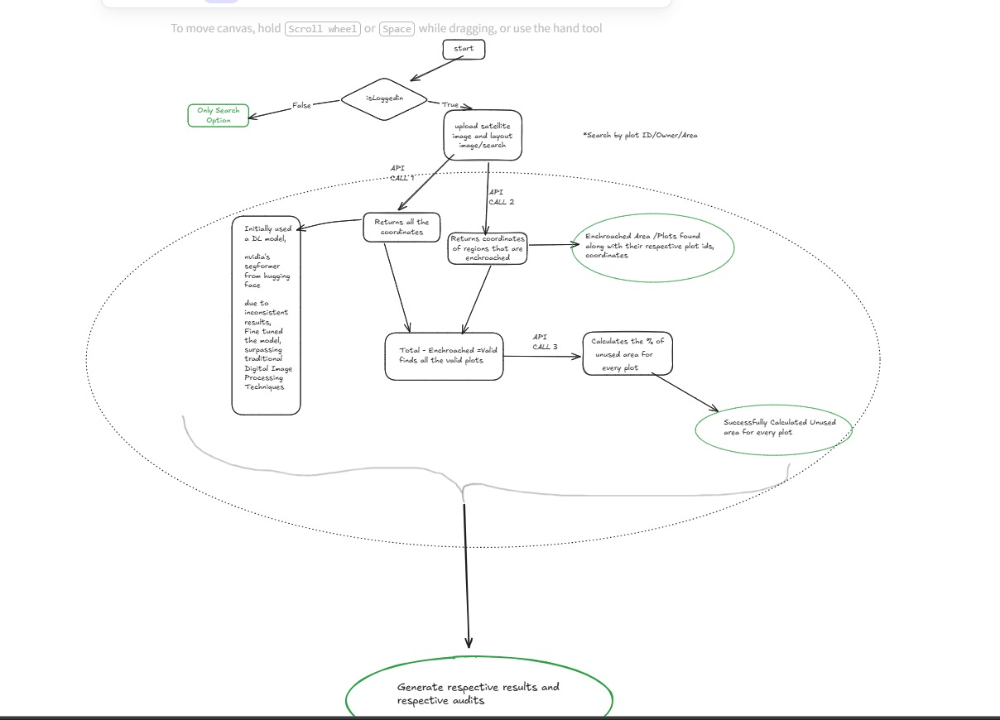
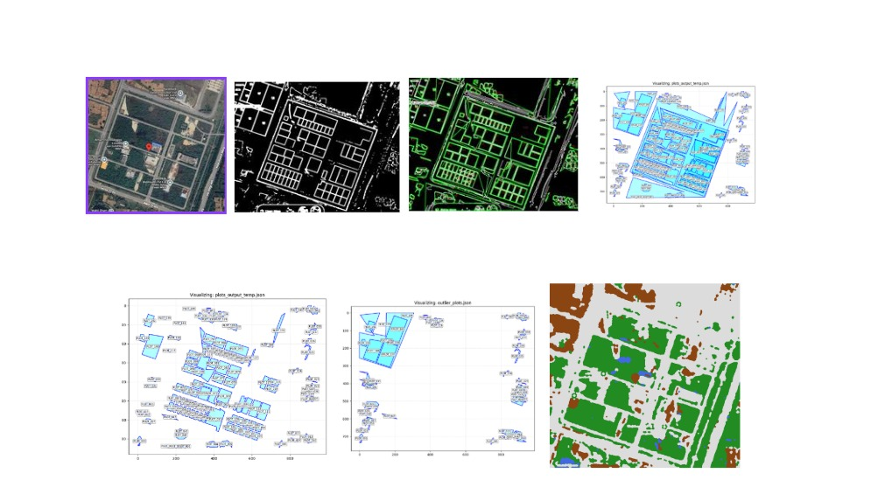

# GeoAudit

# Automated Land Analysis System

## Executive Summary

The Automated Land Analysis System is an AI-powered land auditing platform designed to detect illegal encroachments and calculate unused green areas within legally defined plots. The system orchestrates multiple computer vision microservices through a centralized backend architecture to automate what is traditionally a slow, manual, and error-prone process. By comparing official land layout maps with real-time satellite imagery, the system identifies unauthorized construction and quantifies green space utilization within valid plots. The solution integrates Deep Learning-based semantic segmentation, image preprocessing techniques, and microservice orchestration to deliver structured, audit-ready outputs.

The final output is a structured JSON report and a visual map highlighting:

- Encroached plots
- Valid plots
- Percentage of unused green area per plot
- A color-coded segmentation map for land classification

---

## Introduction

Urban expansion and unauthorized land development pose significant governance challenges. Government bodies and urban planners often rely on manual inspection and traditional image processing tools to monitor encroachments and ensure green space compliance.

These methods suffer from:

- Human bias and oversight
- Inconsistent results due to lighting variations
- Complex terrain interpretation challenges
- High operational costs and time consumption

Our solution replaces manual intervention with a scalable, AI-driven microservices architecture that automates encroachment detection and land utilization analysis with high accuracy and efficiency.

---

## Problem Statement

Manual verification of land encroachment and green space compliance is:

- Time-consuming
- Resource-intensive
- Prone to human error
- Difficult to scale

Traditional Digital Image Processing (DIP) techniques often fail when dealing with:

- Variable lighting conditions
- Shadow interference
- Complex urban terrain
- Irregular plot geometries

There is a need for a robust, scalable, and intelligent system capable of:

- Extracting plot coordinates from layout maps
- Detecting unauthorized land usage
- Performing pixel-level land cover classification
- Generating automated compliance reports

---

## Project Objectives

The key objectives of the project are:

- Automate encroachment detection using satellite imagery.
- Digitize layout maps into coordinate-based polygons.
- Identify encroached vs valid plots programmatically.
- Perform semantic segmentation for land cover classification.
- Calculate unused green area percentage per valid plot.
- Generate structured audit-ready reports.

---

## System Architecture

The project follows a Microservices Orchestration Architecture, where a central FastAPI-based Orchestrator manages communication between specialized image-processing services.

### Technology Stack

| Layer                | Technology Used      | Purpose                                       |
| :------------------- | :------------------- | :-------------------------------------------- |
| Frontend             | React.js             | User interface & visualization                |
| Backend              | Node.js + Express.js | Web server & API routing                      |
| Database             | MongoDB              | Storing plot data & audit reports             |
| Image Processing API | FastAPI (Python)     | AI-based image processing                     |
| Segmentation Model   | SegFormer / SMP      | Land cover classification                     |
| Image Processing     | OpenCV, NumPy        | Masking, pixel operations, coordinate mapping |
| Communication        | REST APIs (JSON)     | Microservice interaction                      |

---

## Workflow & API Orchestration

The system follows a structured dependency chain:

### 1. Data Ingestion

User uploads:

- `layout_image` (official plan)
- `satellite_image` (real-world condition)

These are sent to the FastAPI Orchestrator.

### 2. API Call 1 – Plot Extraction

The first API extracts:

- Plot IDs
- Polygon coordinates

Image processing techniques applied:

- Image cleaning
- Contrast resolution
- Morphological operations
- Contour detection

**Output:** List of all official plot coordinates.

### 3. API Call 2 – Encroachment Detection

The second API analyzes satellite imagery to detect unauthorized development.
Processing steps:

- Image segmentation
- Morphological refinement
- Region comparison against layout coordinates

**Output:** Coordinates of encroached plots.

### 4. Validation Logic

The system computes:
Valid Plots = All Plots − Encroached Plots
This ensures green space analysis is only performed on legally valid plots.

### 5. API Call 3 – Segmentation & Green Area Calculation

This stage performs two major tasks:

**Semantic Segmentation:**
A Transformer-based segmentation model (SegFormer / SMP) classifies each pixel into categories:

- Vegetation (Green)
- Urban
- Water
- Barren land

**Output:**

- Color-coded segmentation map
- Pixel classification mask

**Green Area Calculation per Plot:**
For each valid plot:

- The plot polygon is masked.
- Green pixels inside the masked region are counted.
- Total pixels in the plot are counted.
- Percentage is calculated:
  Green Area Percentage = (Vegetation Pixels within Plot / Total Pixels within Plot Boundary) \* 100

### Image Processing Techniques Used

The following techniques were implemented during API calls:

- Image Cleaning (noise removal)
- Contrast Resolution
- Morphological Transformations (dilation, erosion)
- Masking & Bitwise operations
- Contour detection
- Pixel-level segmentation
- Coordinate transformation & mapping

These ensure robustness against real-world variations like shadows, blur, and terrain irregularities.

---

## Output Generation

The final system produces:

**JSON Audit Report:**

- Plot ID
- Encroachment status
- Green area percentage
- Compliance status

**Visual Output:**

- Encroached plots highlighted
- Valid plots marked
- Segmentation color map overlay

This enables quick administrative decision-making.

---

## Infrastructure & Deployment

The system is designed for scalable cloud deployment. Key Implementation Decisions:

- FastAPI deployed for high-performance async processing.
- `opencv-python-headless` used to eliminate GUI dependencies.
- Docker containerization for portability.
- Deployment compatible with platforms like Render or cloud VMs.
- `io.BytesIO` used for in-memory image handling to reduce disk I/O latency.

---

## Database & Website Integration

**MongoDB stores:**

- User data
- Plot audit results
- Historical reports

**Node.js + Express:**

- Handles user authentication
- Manages API routing
- Connects frontend to image processing backend

**React Frontend:**

- File upload interface
- Plot visualization
- Interactive encroachment marking
- Audit report display

---

## Scalability & Performance

The microservices architecture ensures:

- Independent scaling of AI services
- Easy model upgrades
- Fault isolation
- Future integration of new geospatial modules

---

## Future Improvements

- **Temporal Analysis:** Compare satellite imagery from multiple years to track progressive encroachment.
- **Multi-Spectral Image Support:** Integrate Sentinel-2 Near-Infrared (NIR) bands for enhanced vegetation detection.
- **GIS Integration:** Direct compatibility with government GIS databases.
- **Automated Legal Compliance Scoring:** AI-driven compliance index for smart city governance.
- **Real-time Monitoring Dashboard:** Admin analytics panel with historical trends.

---

## Conclusion

The Automated Land Analysis System successfully demonstrates how AI-driven microservices can modernize land auditing. By combining Deep Learning, semantic segmentation, and scalable backend architecture, the project provides:

- Automated encroachment detection
- Accurate green space quantification
- Audit-ready structured reporting
- Scalable deployment capabilities

This solution bridges the gap between satellite imagery and actionable governance insights, making urban land management more transparent, data-driven, and efficient.
